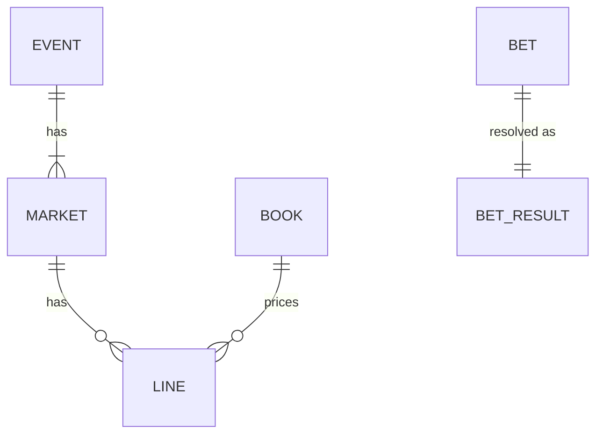
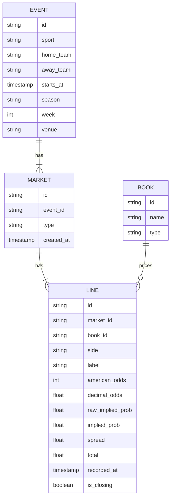
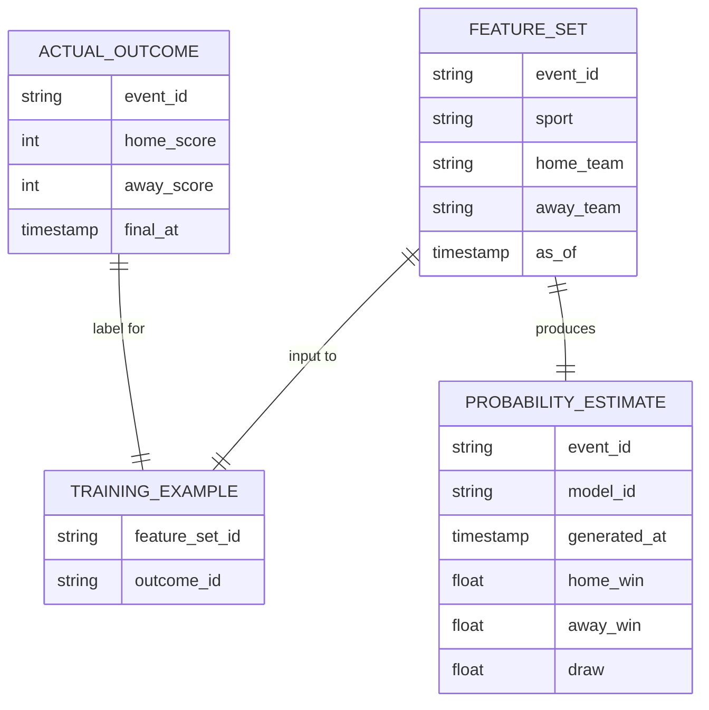
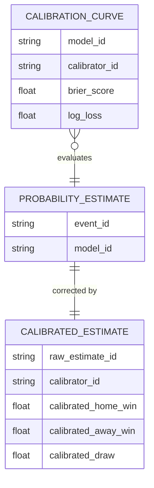
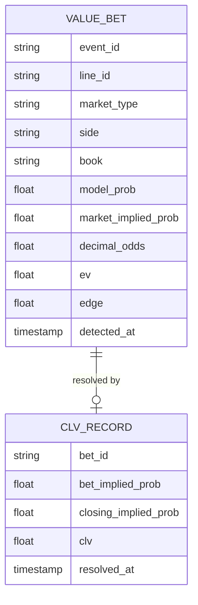
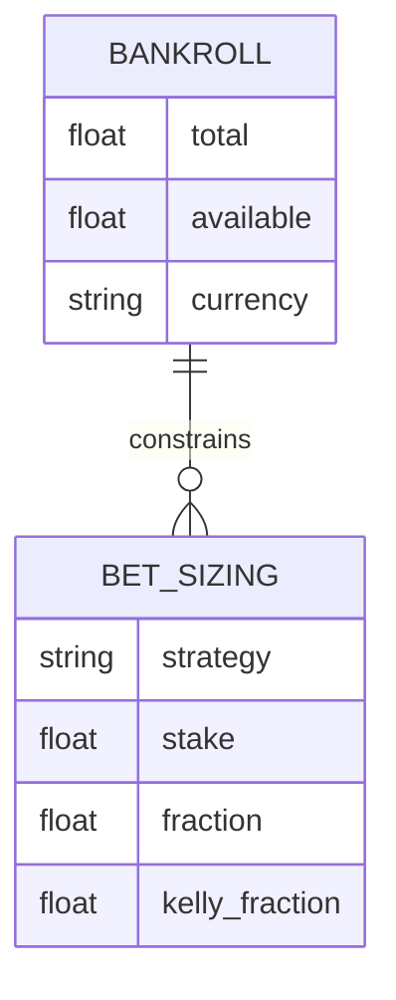
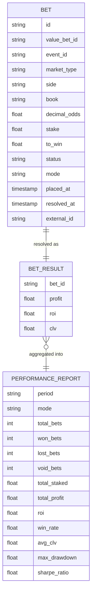
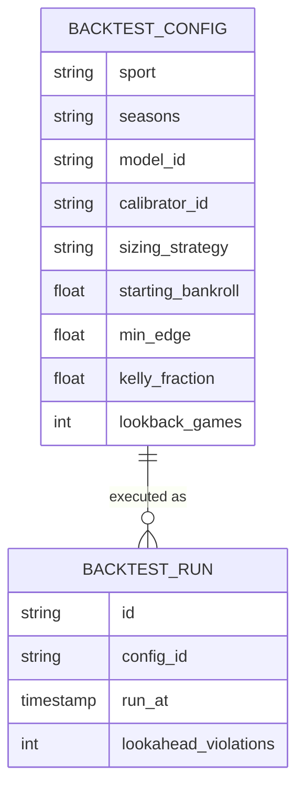
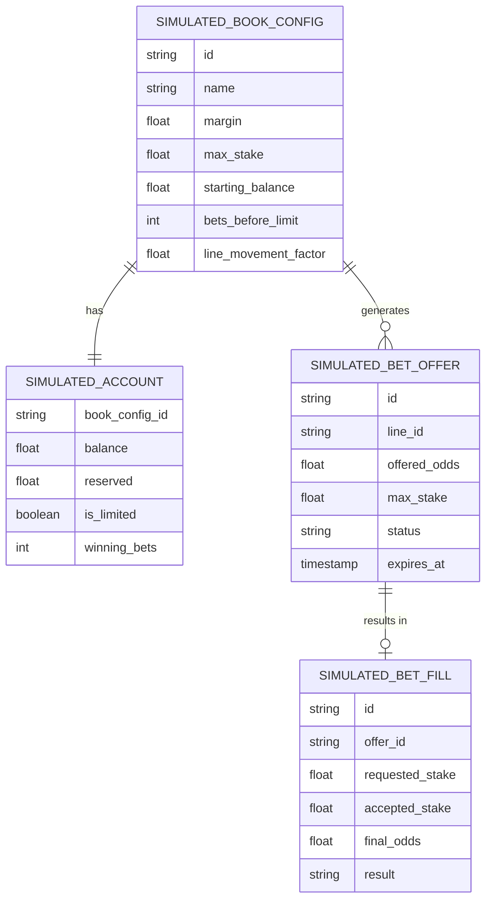

# Data Models

Conceptual entity models for each bounded context. These diagrams are the canonical reference for what data exists and how it relates — implementation files in Go and Python derive from these shapes, not the other way around.

Each context owns its entities. When a context needs data from another context it references it by ID only — it never shares a type definition across the boundary.

---

## How to Read These Diagrams

Each diagram uses **crow's foot notation** to show how entities relate to one another. The symbols on each end of a connecting line describe how many of one thing can be associated with one of the other thing.

| Symbol (end of line) | Meaning |
|----------------------|---------|
| `\|\|` — a single vertical bar | Exactly one |
| `o\|` — a circle and a bar | Zero or one (optional) |
| `\}` or `{` — a crow's foot | Zero or more (many) |
| `\|{` — a bar and a crow's foot | One or more (at least one) |

Read a relationship left-to-right using both ends together:



| Relationship | How to read it |
|---|---|
| `EVENT \|\|--\|{ MARKET` | One event has one or more markets (a game always has at least a moneyline) |
| `MARKET \|\|--o{ LINE` | One market has zero or more lines (a market may exist before any book has priced it) |
| `BOOK \|\|--o{ LINE` | One book prices zero or more lines (a book may not cover every market) |
| `BET \|\|--\|\| BET_RESULT` | One bet resolves to exactly one result |

The label in the middle (e.g., `"has"`, `"prices"`) describes the nature of the relationship in plain language. The crow's foot end always points at the "many" side.

---

## Market Data

The foundational context. Every other context either reads from Market Data or produces data that eventually flows back into it (e.g., closing lines resolving value bets).



| Entity | Field | Note |
|--------|-------|------|
| BOOK | type | One of: `sharp`, `soft`, `exchange` |
| EVENT | sport | One of: `nfl`, `nba`, `mlb`, `nhl`, `soccer` |
| EVENT | week | Populated for NFL only; null for all other sports |
| MARKET | type | One of: `moneyline`, `spread`, `total`, `player_prop` |
| LINE | side | One of: `home`, `away`, `draw`, `over`, `under` |
| LINE | raw_implied_prob | Implied probability before removing bookmaker margin (overround) |
| LINE | implied_prob | Devigged — the market's true probability estimate; always in [0, 1] |
| LINE | spread | Populated for spread markets only; null otherwise |
| LINE | total | Populated for totals markets only; null otherwise |
| LINE | is_closing | True only for the line recorded at or nearest to game time |

**Ports (behavior contracts, not data shapes)**

- `OddsProvider` — fetches events, markets, and lines from an external source; implemented by a static file reader for backtesting and a live bookmaker client for paper trading and live execution
- `LineStore` — persists and queries line history; implemented in-memory for tests and against PostgreSQL for running services

---

## Statistical Modeling

Produces probability estimates from historical features. Has no knowledge of bookmakers, odds, or money.



| Entity | Field | Note |
|--------|-------|------|
| FEATURE_SET | as_of | Hard cutoff: no feature may be derived from data after this timestamp; enforces the lookahead bias guard |
| PROBABILITY_ESTIMATE | draw | Null for sports without a draw outcome (NFL, NBA, MLB) |
| PROBABILITY_ESTIMATE | home_win + away_win + draw | Must sum to 1.0 |
| PROBABILITY_ESTIMATE | model_id | Identifies which model produced the estimate; used for calibration tracking |

**Ports**

- `Model` — fits on training examples and predicts a probability estimate for a feature set; implemented by Elo, Poisson, logistic regression, XGBoost, and ensemble variants
- `FeatureExtractor` — computes a feature set for a given event as of a given timestamp; one implementation per sport

---

## Calibration

Wraps a probability estimate and corrects its raw probabilities to be better calibrated. Depends on Statistical Modeling; feeds into Value Analysis.



| Entity | Field | Note |
|--------|-------|------|
| CALIBRATED_ESTIMATE | raw_estimate_id | Foreign reference into Statistical Modeling context — ID only |
| CALIBRATED_ESTIMATE | calibrated_draw | Null for sports without a draw outcome |
| CALIBRATION_CURVE | brier_score | Lower is better; a perfectly calibrated model scores 0 |
| CALIBRATION_CURVE | log_loss | Lower is better; the training objective for logistic regression |

**Ports**

- `Calibrator` — fits on a held-out set of raw probabilities and outcomes, then transforms new raw probabilities into corrected ones; implemented by Platt scaling and isotonic regression

---

## Value Analysis

Compares calibrated model probabilities against market-implied probabilities to surface positive expected value opportunities. Receives data from both Market Data and Calibration.



| Entity | Field | Note |
|--------|-------|------|
| VALUE_BET | line_id | Foreign reference into Market Data context — ID only |
| VALUE_BET | model_prob | The calibrated probability; never raw model output |
| VALUE_BET | market_implied_prob | Devigged implied probability from the line |
| VALUE_BET | ev | `(model_prob × decimal_odds) − 1`; must be positive to qualify as a value bet |
| VALUE_BET | edge | `model_prob − market_implied_prob`; must exceed the configured minimum threshold |
| CLV_RECORD | bet_id | Foreign reference into Bet Tracking context — ID only |
| CLV_RECORD | clv | `closing_implied_prob − bet_implied_prob`; positive means bet was placed at better-than-closing odds — the long-run signal of genuine edge |

---

## Bankroll Management

Computes stake sizes from an edge and current bankroll. Has no knowledge of specific markets, events, or models.



| Entity | Field | Note |
|--------|-------|------|
| BANKROLL | available | `total` minus all stakes reserved for open (unresolved) bets |
| BET_SIZING | strategy | One of: `full_kelly`, `half_kelly`, `quarter_kelly`, `flat` |
| BET_SIZING | kelly_fraction | The raw Kelly output before applying the fractional multiplier |
| BET_SIZING | fraction | `stake / bankroll.total`; the actual portion of bankroll being risked |

**Ports**

- `Sizer` — given an EV, decimal odds, and bankroll, returns a bet sizing; implemented by full Kelly, fractional Kelly variants, and flat unit

---

## Bet Tracking

Records every bet signal and its eventual outcome. The system of record for all performance reporting. Receives data from Value Analysis and Bankroll Management.



| Entity | Field | Note |
|--------|-------|------|
| BET | value_bet_id | Foreign reference into Value Analysis context — ID only |
| BET | status | One of: `pending`, `open`, `won`, `lost`, `void`, `paper` |
| BET | mode | One of: `backtest`, `paper`, `live`; paper and backtest bets never involve real money |
| BET | to_win | `stake × (decimal_odds − 1)` |
| BET | external_id | Bookmaker's reference number; empty for `backtest` and `paper` mode bets |
| BET | resolved_at | Null until the game is final |
| BET_RESULT | profit | Positive for wins, negative for losses, zero for voids |
| BET_RESULT | clv | Null until the closing line is known; populated by a CLV_RECORD from Value Analysis |
| PERFORMANCE_REPORT | period | A time window label (e.g., `"2023-nfl"`, `"all-time"`) |

**Ports**

- `BetStore` — persists and queries bets and performance reports; implemented in-memory for backtesting and against PostgreSQL for running services

---

## Backtesting

Drives the full pipeline over historical data to validate model and strategy performance before any real money is involved.



| Entity | Field | Note |
|--------|-------|------|
| BACKTEST_CONFIG | seasons | List of season identifiers to replay, e.g. `["2021", "2022", "2023"]` |
| BACKTEST_CONFIG | min_edge | Minimum edge threshold passed to the `ValueDetector`; e.g. `0.03` for 3% |
| BACKTEST_CONFIG | lookback_games | How many games of history the model uses for its training window |
| BACKTEST_RUN | lookahead_violations | Count of future-data access attempts caught by the bias guard; **must be 0 for the run to be valid** |

A `BACKTEST_RUN` produces `BET` records (mode = `backtest`) and a `PERFORMANCE_REPORT` in the Bet Tracking context. Those are the outputs; the backtesting context itself holds only the configuration and run metadata.

---

## Simulated Bookmaker

A concrete implementation of the `BookmakerClient` interface used during paper trading. Its purpose is to exercise the full live pipeline — bet placement, line movement, account limits, and partial fills — without real money and without depending on an external API. By the time a real bookmaker adapter is written in Phase 9, every edge case the live pipeline might encounter has already been validated against this implementation.

The simulated bookmaker is intentionally adversarial: it moves lines after bets, rejects stale requests, and limits accounts that win consistently — matching how real books behave.



| Entity | Field | Note |
|--------|-------|------|
| SIMULATED_BOOK_CONFIG | margin | Overround added to odds; e.g. `0.05` means the book's implied probabilities sum to 1.05 — simulates the vig |
| SIMULATED_BOOK_CONFIG | max_stake | Maximum stake the book will accept on a single bet before applying limits |
| SIMULATED_BOOK_CONFIG | bets_before_limit | After this many resolved winning bets, `max_stake` is cut to simulate account profiling |
| SIMULATED_BOOK_CONFIG | line_movement_factor | How much the offered odds shift after each accepted bet; simulates market impact of placing money |
| SIMULATED_ACCOUNT | reserved | Funds held against open (unresolved) bets; `available = balance − reserved` |
| SIMULATED_ACCOUNT | is_limited | Once true, `max_stake` is reduced to a small fraction — mirrors real book behaviour toward profitable accounts |
| SIMULATED_BET_OFFER | status | One of: `available`, `expired`, `taken`; offers expire if not acted on within the window |
| SIMULATED_BET_OFFER | offered_odds | May differ from the originally requested odds if the line has already moved |
| SIMULATED_BET_FILL | accepted_stake | May be less than `requested_stake` if the request exceeded `max_stake` (partial fill) |
| SIMULATED_BET_FILL | result | One of: `accepted`, `rejected`, `partial`, `line_moved`; `line_moved` means odds changed between offer and fill |

**Behaviours the simulated bookmaker exercises**

- **Line movement** — after each accepted bet, offered odds shift by `line_movement_factor × stake`; subsequent requests see the moved line
- **Bet rejection** — a bet placed on an expired offer or a line that has already moved returns result `line_moved`
- **Partial fills** — stakes above `max_stake` are accepted at `max_stake`; the remainder is returned unfilled
- **Account limiting** — after `bets_before_limit` winning bets, `max_stake` drops to a configurable floor; mirrors the most common friction point in live execution

---

## Cross-Context Data Flow

```
[Market Data]
  EVENT, MARKET, LINE
        │
        │ line_id reference
        ▼
[Value Analysis] ◄── calibrated_estimate_id ── [Calibration] ◄── [Statistical Modeling]
        │
        │ value_bet_id reference
        ▼
[Bet Tracking]
  BET, BET_RESULT, PERFORMANCE_REPORT
        ▲
        │ bet_id reference
[Value Analysis]
  CLV_RECORD (resolved after game using closing LINE from Market Data)
```

No context holds a full entity from another context. Every cross-context link is a reference by ID. This is what allows each context to evolve its internal model independently and what makes the `OddsProvider` and `BookmakerClient` substitution possible without touching any upstream logic.
